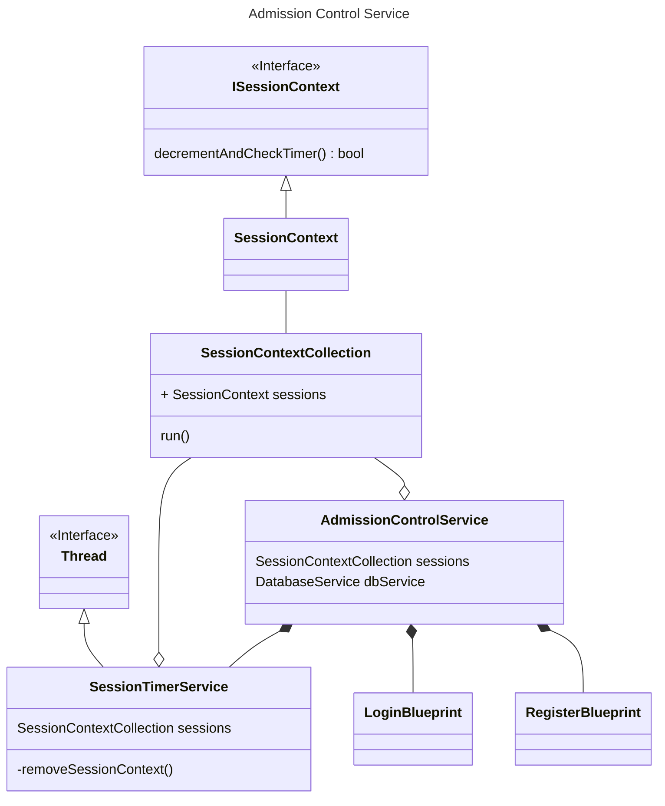

```mermaid
---
title: Admission Control Service
---
classDiagram
    %%%%%%%%%% Session Timers %%%%%%%%%%
    class SessionContext
    class ISessionContext {
        decrementAndCheckTimer() bool
    }
    <<Interface>> ISessionContext 
    class Thread
    <<Interface>> Thread
    class SessionContextCollection {
        + SessionContext sessions
        run()
    }
    class SessionTimerService {
        SessionContextCollection sessions
        -removeSessionContext()
    }

    ISessionContext <|-- SessionContext 
    SessionContext -- SessionContextCollection
    Thread <|-- SessionTimerService
    SessionContextCollection --o SessionTimerService


    %%%%%%%%%% Admission Control Service %%%%%%%%%%
    class AdmissionControlService {
        SessionContextCollection sessions
        DatabaseService dbService
    }
    class SessionTimerService {

    }
    class LoginBlueprint
    class RegisterBlueprint
    
    SessionContextCollection --o AdmissionControlService
    AdmissionControlService *-- SessionTimerService
    AdmissionControlService *-- LoginBlueprint
    AdmissionControlService *-- RegisterBlueprint
```